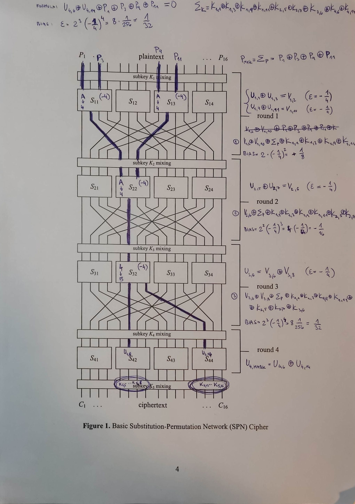

## Linear cryptanalysis



| S-box | input | output | bias |
| ----- | ----- | ------ | ---- |
| S11   | A     | 4      | -1/4 |
| S13   | A     | 4      | -1/4 |
| S22   | A     | 4      | -1/4 |
| S32   | 4     | 5      | -1/4 |

```
bias = 2**3 * (-1/4)**4 = 1 / 32 = 0.03125
P_mask = 1010_0000_1010_0000
U_mask = 0000_0100_0000_0100
```

### Výsledky

Analýza byla spuštěna na plaintext/ciphertext s klíčem 0xBEAF a o velikosti 1000, 5000 a 10 000 bloků (viz složka `test/`). Analýza útočila na 2. a 4. bajt klíče. Hledaným výsledkem byl tedy 0x0E0F. Výsledek byl nalzen na vzorku 5000 bloků na 9. místě (seřazeno podle biasu). V případě 10 000 bloků měl správný výsledek největší bias.

## Differential cryptanalysis


| S-box | input | output | propability |
| ----- | ----- | ------ | ----------- |
| S11   | B     | 2      | 1/2         |
| S13   | B     | 2      | 1/2         |
| S23   | A     | 8      | 3/8         |
| S31   | 2     | 5      | 3/8         |

```
propability = (1/2)**2 * (3/8)**2 = 9 / 256 = 0.03515625
deltaP_mask = 1011_0000_1011_0000
deltaU_mask = 0000_1000_0000_1000
```

### Výsledky

Klíč byl zvolen znovu 0xBEAF. Analýza útočila na 2. a 4. bajt klíče. Už při pouhých 100 blocích bylo možné nalézt správné řešení 0x0E0F s nejvyší pravděpodobností ze všech klíčů. Byly testovány i jiné klíče, aby se redukovala náhoda ve prospěch analýzy.
